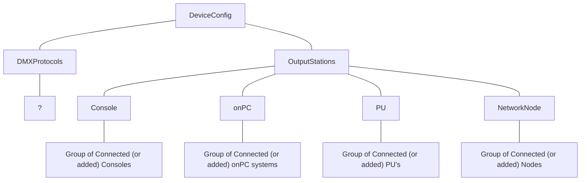

# Output Stations in MA3 2.3.2.0

> [!WARNING] Since grandMA3 is updated continously the scripts for outputstations might not work across versions. If structures or naming change in a new version the LUA scripts might need to be rewritten for that specific version.

The current structure containg output stations can be accessed through the grandMA3 API LUA function called `DeviceConfiguration`. The hierarchy is as follows:

